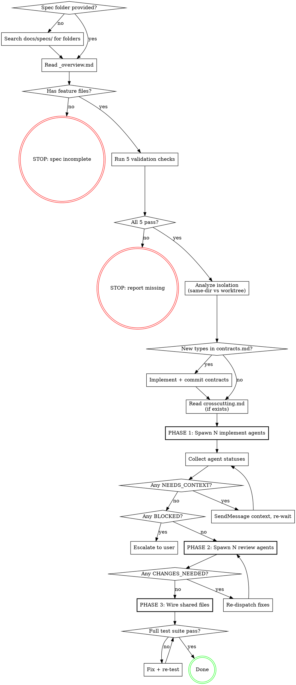

# Parallel Execute — Spec-Driven Parallel Agent Orchestration

Spawn N agents from a validated spec folder. Each agent reads its feature file + contracts — no grep needed, no briefs needed. The spec is the single source of truth.

**Announce at start:** "I'm using the parallel-execute skill to implement planned features from the spec."

## Language

- **Communication with user** → Follow CLAUDE.md language setting (default: Vietnamese).
- **Code, commit messages, technical output** → English.

<HARD-GATE>
Do NOT spawn any agent until the spec has been validated against ALL items in the Validation Checklist. A spec missing ANY required element means agents will waste tokens exploring or guessing. Fix the spec first.
</HARD-GATE>

## Anti-Pattern: "I'll Brief the Agents Myself"

If you find yourself writing agent prompts with file paths, code patterns, or architectural context — STOP. That information belongs IN the spec files. If the feature file doesn't have it, the spec is incomplete. Fix the spec, don't compensate with verbose prompts.

## Checklist

You MUST create a task for each of these items and complete them in order:

1. **Locate spec folder** — find and read `_overview.md`
2. **Validate spec quality** — run all 5 validation checks
3. **Analyze isolation needs** — decide same-dir vs worktree per agent
4. **Implement shared contracts** — if contracts.md has new types, commit first
5. **Spawn implement agents** — all in one message block, parallel
6. **Handle agent statuses** — route by DONE / NEEDS_CONTEXT / BLOCKED
7. **Spawn review agents** — parallel review of completed work
8. **Wire shared files** — controller integrates shared file changes
9. **Verify final state** — full test suite on integrated codebase

## Process Flow



## DDD Code Format

Specs use 4-segment DDD codes for identification:

```
{Context}.{Aggregate}.{Capability}.{Layer}

IDN.OAU.CMD.API
 3ch  3ch   3ch   3ch
```

With phase prefix in section headers:

```
{Phase}:{Context}.{Aggregate} — {Feature Name}

P01:LIV.STN — Live Radio API
```

- Phase: P01-P09 Planning, B01-B09 Building, T01-T09 Testing, L01-L09 Launched, M01-M09 Maintaining
- Context: bounded context (IDN=Identity, CTN=Content, SCL=Social, etc.)
- Aggregate: domain object cluster (OAU=OAuth, FLW=Follow, CLP=Clip, etc.)
- Capability: CMD=Command, QRY=Query, EVT=Event, VEW=View, PLG=Plugin, CTR=Contract
- Layer: API, WEB, IOS, AND, SHR, DBS

Each project defines its own Context + Aggregate codes in `registry.md`.

## Spec Folder Structure

Parallel-execute expects this folder structure (produced by `/reverse-spec`):

```
docs/specs/{project}/
├── _overview.md              # Read this FIRST — index + system context
├── registry.md               # DDD codes, contexts, aggregates, file mapping
├── contracts.md              # Shared types/interfaces — actual code
├── crosscutting.md            # OPTIONAL — auth, error handling, logging patterns
├── decisions/                 # ADRs — read only if context needed
└── features/
    ├── _overview.md           # Index of planned features
    └── P01-feature-name.md    # Self-contained feature spec with Execution section
```

**What each agent reads (3 files max):**
1. `features/P0x-feature.md` — its task spec (goal, files, patterns, verify)
2. `contracts.md` — shared types to import
3. `crosscutting.md` — patterns to follow (if exists)

Agents do NOT need to read `registry.md`, `_overview.md`, or `decisions/`. Those are for the controller (you).

## The Process

### Locating the spec

- If user provides path → use directly
- If user says "implement feature X" → search `docs/specs/` for folders
- Read `_overview.md` first — it indexes all files and lists contexts
- Check `features/_overview.md` for list of planned features
- If multiple spec folders exist → ask user which one

### Validation (5 checks, ALL must pass)

Read each feature file in `features/` and validate:

| # | Check | How to verify | If fails |
|---|-------|---------------|----------|
| 1 | **DDD codes exist** | Each feature file header has `P0x:{CTX}.{AGG}` format | "Feature file {X} missing DDD code in header." |
| 2 | **Sections self-contained** | Each feature file has: `→` file path + code pattern + verify command | "Feature {X} missing file path or pattern." |
| 3 | **Shared contracts** | If ≥2 feature files import same type → type exists in `contracts.md` with actual code | "Features {A,B} share types but contracts.md missing definition." |
| 4 | **Verify commands** | Each feature file's `## Execution` section has Verify column filled | "Feature {N} missing verify command." |
| 5 | **Merge order** | Feature files with shared files list what each agent adds + merge order | "Feature {N} has shared files but no merge order." |

**If any check fails:** Report EXACTLY which check failed. Do NOT spawn. Do NOT "fill in" missing info.

### Analyzing isolation needs

```
Agent modifies existing files that OTHER agents also modify?
├─ No → SAME DIRECTORY (agents only create new files)          90% of cases
├─ Yes, append-style (add imports/functions/routes)
│   → SAME DIRECTORY + controller wires shared files after     9% of cases
└─ Yes, logic conflict (modify same function body)
    → WORKTREE isolation                                        1% of cases
```

**Default is same directory.** Worktree is the exception.

### Implementing shared contracts

When `contracts.md` has types that don't exist in the codebase yet:
1. Read `contracts.md`
2. Create the type/interface files as specified
3. Commit to current branch
4. All agents will see them

### Reading crosscutting patterns

If `crosscutting.md` exists, read it before spawning agents. Include a one-line summary in each agent's prompt:
- "Auth: JWT middleware injects `userContext` on every route"
- "Errors: throw `AppError(code, message)`, middleware catches and formats"

This saves each agent from reading crosscutting.md themselves.

### PHASE 1: Spawning implement agents

**Agent prompt template:**

```
Implement {feature name}

## Your Task
Read file: {spec-folder}/features/{feature-file}
Read file: {spec-folder}/contracts.md

{If crosscutting.md exists, include 1-line summaries here}

## Rules
1. Read your feature file — it has goal, file paths, code patterns, verify command
2. Read contracts.md — import shared types from there
3. Create NEW files listed in your feature spec
4. Do NOT modify shared files — controller handles wiring
5. Run verify command from your feature spec
6. Report status: DONE / DONE_WITH_CONCERNS / NEEDS_CONTEXT / BLOCKED

Work from: {repo-path}
```

**Critical rules:**
- ALL agents spawn in ONE message block. Never sequential.
- Maximum 8 agents at once. If more → batch in waves.
- Prompt stays SHORT. Feature file + contracts.md are the source of truth.
- Select model by complexity: sonnet for VEW/PLG, opus for CMD/QRY/CTR.

### Handling agent statuses

```
DONE              → Queue for Phase 2 review
DONE_WITH_CONCERNS → Read concerns. If blocking → fix. If not → queue review.
NEEDS_CONTEXT     → SendMessage with missing info, agent continues
BLOCKED           → Log reason. Ask user if architectural.
PARTIAL           → Accept done parts. Re-spawn for remaining scope.
```

### PHASE 2: Parallel review

Spawn review agents — one per completed feature:

```
Review implementation of {feature name} against spec.
Spec: {spec-folder}/features/{feature-file}
Contracts: {spec-folder}/contracts.md
Files to review: {list of new files from implementer report}

Check:
1. SPEC COMPLIANCE — does implementation match feature spec?
2. CODE QUALITY — clean code, no bugs?
3. TESTS — verify command passes?

Report: APPROVED / CHANGES_NEEDED (list issues with file:line)
```

Review agents run PARALLEL. Use sonnet. CHANGES_NEEDED → re-dispatch fix.

### PHASE 3: Wire shared files

Controller (main context) integrates shared files — add imports, route mounts, API functions, navigation entries. Use merge order from feature files' Execution sections.

Run full test suite.

**Why controller?** Cross-scope awareness needed. Individual agents only know their feature.

### Final verification

**REQUIRED:** Use superpowers:verification-before-completion before claiming done.

## Red Flags

| Thought | What to do instead |
|---------|--------------------|
| "Let me explore the codebase first" | Spec files have all context. If not, fix spec. |
| "I'll write a detailed brief for each agent" | Fix the spec. Briefs = spec gap. |
| "Let me run a plan agent first" | Spec folder IS the plan. |
| "Every agent needs its own worktree" | Default same-dir. Worktree only for logic conflicts. |
| "I'll spawn agents one at a time" | Parallel. One message block. |
| "Skip validation, spec looks fine" | 30s validation saves 30min of broken agents. |
| "Skip review, tests pass" | Tests ≠ spec compliance. Review catches drift. |
| "Wire shared files as I go" | Wire AFTER all agents. Cross-scope awareness needed. |
| "Agent needs to read registry.md" | No. Feature file + contracts.md is enough. |
| "Let me read all feature files for the agent" | Agent reads its own feature file. One file per agent. |

## Key Principles

- **Spec folder is the single source of truth** — agents read feature files, not briefs
- **3 files per agent max** — feature file + contracts.md + crosscutting.md (optional)
- **Same directory by default** — worktree only for logic conflicts
- **Validate before spawn** — 30s saves 30min
- **Contracts commit first** — shared types before parallel work
- **All agents in one message** — parallel, never sequential
- **Status-based routing** — not binary success/fail
- **Parallel review** — catches spec drift early
- **Controller wires** — cross-scope awareness for shared files

## References

- **Spec creation:** `/reverse-spec` — creates spec folder with DDD codes
- **Verification:** superpowers:verification-before-completion — final check before done
- **Commit format:** `feat(IDN.OAU): description [B05.3]`
